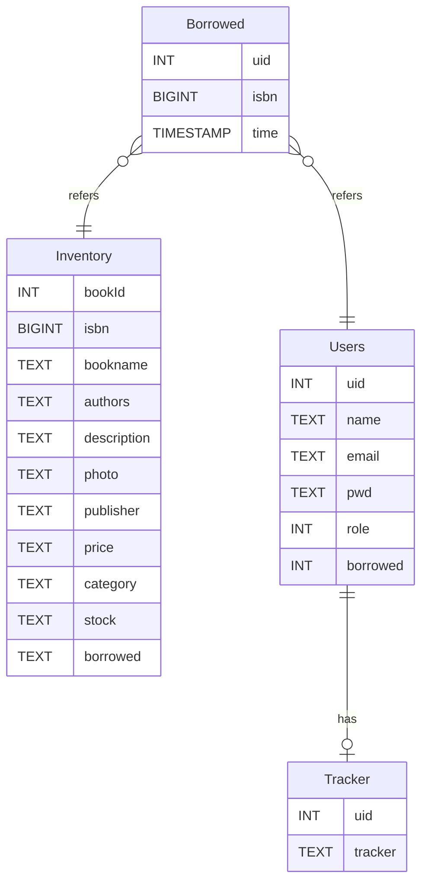

### 图书管理系统
[](https://github.com/EduarteXD/) [](https://oxdl.cn) [](https://github.com/EduarteXD/BookManager/releases)


****

#### 基本功能

- 图书搜索，入库
- 图书借还
- 逾期提醒
- 基本权限管理
- 一个基本的ISBN检索图书Api

#### 图书搜索与入库

实现由ISBN编码精确搜索图书并入库或在库存中按照书名进行模糊搜索


主页👆


按照ISBN号搜素Be like👆，此时由于此书不在库中，系统管理员可以将其添加到书库，并修改图书基本信息和添加数量👇


模糊搜素👆

#### 图书借还管理


当搜索到想要借阅的书目，进入详情页后，可以进行借阅👆，此时此书会被加入到借阅清单中，但并不会扣减库存，可以被他人抢占


点击借阅按钮即可完成尚有库存书目的借阅并自动清理借阅清单👆，此时会将相应图书的库存从数据库中减去，完成借阅


#### 逾期提醒

完成借阅之后可以进入还书页面查看借阅的书目，这里为了方便演示将其中一本书的借阅时间手动调整到了21天前👆，此时第一本书已经逾期，可以看到在页面加载完成后，会弹出提示还书的通知👇


当然，如果你的浏览器不幸不支持Notification Api或是拒绝了通知权限，我们有替代方案👆


当你有书本逾期时候，你将无法借阅新书👆

#### 基本权限管理

用户被分为三个等级：游客，用户和管理员

- 游客可以对书籍进行检索但无权借阅
- 用户可以借阅12本书
- 管理员可以添加书目入库与访问库存

在此不多作演示

#### 图书检索Api

最后，当然，也是非常重要的一个功能，以上检索图书和入库实际上也是基于此功能


以上为功能介绍

#### 部署

首先创建数据库：



```sql
CREATE TABLE `users` (
	`uid` INT(10) NOT NULL AUTO_INCREMENT,
	`name` TEXT NULL DEFAULT NULL COLLATE 'utf8mb4_bin',
	`email` TEXT NULL DEFAULT NULL COLLATE 'utf8mb4_bin',
	`pwd` TEXT NULL DEFAULT NULL COLLATE 'utf8mb4_bin',
	`role` INT(10) NULL DEFAULT NULL,
	`borrowed` INT(10) NULL DEFAULT '0',
	PRIMARY KEY (`uid`) USING BTREE
)
COLLATE='utf8mb4_bin'
ENGINE=InnoDB
AUTO_INCREMENT=0;

CREATE TABLE `trackers` (
	`tracker` TEXT NULL DEFAULT NULL COLLATE 'utf8mb4_bin',
	`uid` INT(10) NULL DEFAULT NULL
)
COLLATE='utf8mb4_bin'
ENGINE=InnoDB;

CREATE TABLE `inventory` (
	`bookid` INT(10) NOT NULL AUTO_INCREMENT,
	`isbn` BIGINT(19) NULL DEFAULT NULL,
	`bookname` TEXT NULL DEFAULT NULL COLLATE 'utf8mb4_bin',
	`authors` TEXT NULL DEFAULT NULL COLLATE 'utf8mb4_bin',
	`description` TEXT NULL DEFAULT NULL COLLATE 'utf8mb4_bin',
	`photo` TEXT NULL DEFAULT NULL COLLATE 'utf8mb4_bin',
	`publisher` TEXT NULL DEFAULT NULL COLLATE 'utf8mb4_bin',
	`price` TEXT NULL DEFAULT NULL COLLATE 'utf8mb4_bin',
	`category` TEXT NULL DEFAULT NULL COLLATE 'utf8mb4_bin',
	`stock` INT(10) NULL DEFAULT NULL,
	`borrowed` INT(10) NULL DEFAULT '0',
	PRIMARY KEY (`bookid`) USING BTREE,
	UNIQUE INDEX `isbn` (`isbn`) USING BTREE,
	CONSTRAINT `CC1` CHECK ((`borrowed` <= `stock`))
)
COLLATE='utf8mb4_bin'
ENGINE=InnoDB
AUTO_INCREMENT=0;

CREATE TABLE `borrowed` (
	`uid` INT(10) NULL DEFAULT NULL,
	`isbn` BIGINT(19) NULL DEFAULT NULL,
	`time` TIMESTAMP NULL DEFAULT CURRENT_TIMESTAMP
)
COLLATE='utf8mb4_bin'
ENGINE=InnoDB;
```

下载

```shell
mkdir bookManager
cd bookManager
wget https://github.com/EduarteXD/BookManager/releases/download/beta/release.zip && unzip release.zip
rm -rf release.zip
```

在/bookManager目录下创建.env配置文件

```
SQL_HOST=localhost
DB_NAME=库名
DB_USER=用户名
DB_PWD=密码
```

运行

```shell
npm install
npm start
```

配置Nginx反向代理后台WebSocket连接

```ng
location ^~ /socket.io/
{
    proxy_pass http://127.0.0.1:1333/socket.io/;
    proxy_http_version 1.1;
    proxy_set_header Upgrade $http_upgrade;
    proxy_set_header Connection "upgrade";
}
```

##### Hint

你可以在.env文件中添加PORT字段来更改服务端监听端口
